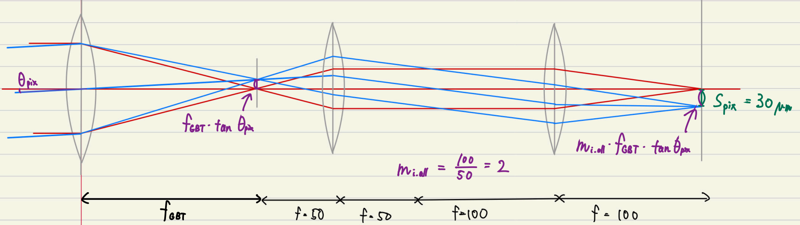

[Miller et al., 2010]: https://pubs.rsc.org/en/content/articlelanding/2010/FD/c004152c#!divAbstract
[PPARC Blog]: https://pparc.gp.tohoku.ac.jp/post_8/
[岩室2009]: http://www.kusastro.kyoto-u.ac.jp/~iwamuro/LECTURE/OBS/atmos.html
[ATRAN]: https://atran.arc.nasa.gov/cgi-bin/atran/atran.cgi
[太陽系天体の高度と方位]: https://eco.mtk.nao.ac.jp/cgi-bin/koyomi/cande/horizontal.cgi
[PPARC観測施設]: https://pparc.gp.tohoku.ac.jp/about-us/observatory/
[Wang, X (2016)]: https://doi.pangaea.de/10.1594/PANGAEA.862331
[なよろ市立天文台]: https://www.nayoro-star.jp/kitasubaru/use/use-access.html
[日本におけるGPS可降水量の季節変化の特徴]: https://www.metsoc.jp/tenki/pdf/2012/2012_10_0917.pdf
[KANATA Telescope]: http://hasc.hiroshima-u.ac.jp/telescope/kanatatel-e.html

- [注釈](#注釈)
- [見積もりの概略](#見積もりの概略)
  - [見積もりで想定する物理過程](#見積もりで想定する物理過程)
  - [シミュレーション上での分光放射輝度の扱い](#シミュレーション上での分光放射輝度の扱い)
  - [シミュレーション上でのFITSファイルの扱い](#シミュレーション上でのfitsファイルの扱い)
- [観測対象の発光](#観測対象の発光)
  - [H3+輝線の放射輝度](#h3輝線の放射輝度)
  - [シミュレーション上での実装](#シミュレーション上での実装)
- [地球大気の発光](#地球大気の発光)
  - [プランクの法則](#プランクの法則)
  - [地球大気のパラメータ](#地球大気のパラメータ)
  - [ATRANによる大気透過率の計算](#atranによる大気透過率の計算)
    - [ハレアカラを想定した代入値と大気透過率](#ハレアカラを想定した代入値と大気透過率)
    - [名寄を想定した代入値と大気透過率](#名寄を想定した代入値と大気透過率)
    - [東広島を想定した代入値と大気透過率](#東広島を想定した代入値と大気透過率)
  - [地球大気の熱輻射による分光放射輝度](#地球大気の熱輻射による分光放射輝度)
- [望遠鏡の発光](#望遠鏡の発光)
  - [望遠鏡光学系のパラメータ](#望遠鏡光学系のパラメータ)
  - [望遠鏡の熱輻射による分光放射輝度](#望遠鏡の熱輻射による分光放射輝度)
- [分光器導入用ファイバー](#分光器導入用ファイバー)
- [近赤外装置による撮像・分光](#近赤外装置による撮像分光)
  - [干渉フィルター透過率の導出](#干渉フィルター透過率の導出)
  - [装置透過率の導出（TOPICS）](#装置透過率の導出topics)
  - [装置透過率の導出（ESPRIT）](#装置透過率の導出esprit)
  - [pixel数関連の導出](#pixel数関連の導出)
  - [システムゲインの導出](#システムゲインの導出)
  - [検出器に到達した段階での分光放射輝度](#検出器に到達した段階での分光放射輝度)
  - [Signalへの換算](#signalへの換算)

# 注釈

pparcの開発論文は以下の通りに省略する。ページ数はPDFのページ数ではなく各ページに記載されているページ番号と対応する。

| 略称    | 年度 | 著者        | タイトル                                                                               |
| ------- | ---- | ----------- | -------------------------------------------------------------------------------------- |
| 高橋M論 | 2005 | 高橋 香代子 | 惑星大気観測のための赤外撮像装置の開発                                                 |
| 小鮒M論 | 2008 | 小鮒 格久   | 木星赤外オーロラの変動現象観測と赤外撮像装置電気回路系の開発                           |
| 宇野M論 | 2009 | 宇野 健     | 木星熱圏イオン・中性風研究に向けた近赤外エシェル分光器の開発                           |
| 北見M論 | 2011 | 北見 拓也   | 赤外観測用InSbアレイセンサ駆動系の開発                                                 |
| 宇野D論 | 2012 | 宇野 健     | 木星赤外オーロラの高度・水平構造：観測研究及び新エシェル分光器の開発                   |
| 野口M論 | 2013 | 野口 恵理子 | 木星オーロラ観測用赤外カメラ搭載InSbイメージセンサ駆動システムの開発と評価             |
| 神原M論 | 2020 | 神原 歩     | 惑星大気近赤外観測用高分散分光器ESPRIT搭載の検出器読み出しシステムと冷却システムの開発 |
|         |      |             |                                                                                        |

# 見積もりの概略

## 見積もりで想定する物理過程

輝線発光に対して、大気や光学系による強度減衰と、sky backgroundや望遠鏡自体の発光が加わりながら検出器に到達し、装置ノイズを含んだカウント値として出力されることを想定する。輝線発光やsky backgroundには波長依存性があるので、波長方向に1次元の分光放射輝度を考え、検出器に到達した段階で波長方向に積分することを想定する。

検出器に到達した光は検出器のフォトダイオードで電子に変換して蓄積され、電流値として出力される。出力された電流値は読み出し回路でカウント値 [DN] に変換され、FITSファイルに記録される。

FITSファイルに記録されたカウント値を用いて、SN比の導出や、観測された輝線の強度比を用いた温度決定などを行う。

## シミュレーション上での分光放射輝度の扱い

| 文字                         | 単位                 | 意味                                   |
| ---------------------------- | -------------------- | -------------------------------------- |
| $\lambda _{division.width} $ | m                    | シミュレーション上での波長方向の分割幅 |
| $\lambda _{lower.limit} $    | m                    | シミュレーションする波長の最小値       |
| $\lambda _{upper.limit} $    | m                    | シミュレーションする波長の最大値       |
|                              |                      |                                        |
| $\lambda $                   | m                    | 光の波長                               |
| $I' _{} $                    | W / m $^2 $ / sr / m | 各段階での波長に対する分光放射輝度     |
| $I $                         | W / m $^2 $ / sr     | 各段階での光の放射輝度                 |
|                              |                      |                                        |

シミュレーションでは $\lambda _{lower.limit} $ ～ $\lambda _{upper.limit} $ までの波長範囲を幅 $\lambda _{division.width} $ で均等に分割した配列を波長 $\lambda $ とする。そして $\lambda $ の配列の各要素に対応する分光放射輝度を $I' _{} $ とする。このとき、放射輝度 $I $ は $I' _{} $ の各要素に $\lambda _{division.width} $ を掛けたものを、 $\lambda _{lower.limit} $ ～ $\lambda _{upper.limit} $ まで足し合わせればよい。

$$
I
= \int I' d \lambda
= \sum _{\lambda = \lambda _{lower.limit}} ^{\lambda _{upper.limit}} I' \cdot \lambda _{division.width}
$$

なお、W = J / s なので分光放射輝度や放射輝度は1秒当たりの量である。

## シミュレーション上でのFITSファイルの扱い

シミュレーションでは仮想的なFITSファイル（自作インスタンス）にカウント値が保存されるものとして実装する。このとき空間分布は考慮せず、FITSファイルはある1pixelのカウント値のみを保存しているものと考えて、以後のSN比などの計算を行う。

# 観測対象の発光

## H3+輝線の放射輝度

| 文字              | 単位             | 意味                      | 代入値 | 参照元                  |
| ----------------- | ---------------- | ------------------------- | ------ | ----------------------- |
| $N(H_3^+) $       | / m $^2 $        | カラム密度                |        |                         |
| $\lambda _{obj} $ | m                | 輝線の中心波長            | 下表   |                         |
| $g _{ns} $        | 無次元           | nuclear spin weight       | 下表   |                         |
| $J' $             | 無次元           | 回転量子数                | 下表   |                         |
| $h $              | m $^2 $ kg / s   | プランク定数              |        | 物理定数                |
| $c $              | m / s            | 光速                      |        | 物理定数                |
| $A _{if} $        | /s               | アインシュタインのA係数   | 下表   |                         |
| $E' $             | /cm              | Energy of the upper level | 下表   |                         |
| $k_B $            | J / K            | ボルツマン定数            |        | 物理定数                |
| $T _{hypo} $      | K                | 想定するH3+温度           |        |                         |
| $Q(T) $           | 無次元           | partition function        |        | [Miller et al., 2010][] |
|                   |                  |                           |        |                         |
| $\omega _{if} $   | /cm              | 波数                      |        |                         |
| $I _{obj} $       | W / m $^2 $ / sr | 観測対象の放射輝度        |        |                         |
|                   |                  |                           |        |                         |

$$
I _{obj}
= N(H_3^+) \times
  \cfrac
    {g _{ns} (2J' + 1) hc (\omega _{if} \times 100) A _{if} \times \exp{(- hc \cdot E' \times 100/k_B T _{hypo})}}
    {4 \pi Q(T _{hypo})}
$$

$$
where \:
\omega _{if} = \frac{1}{\lambda _{obj}} \cdot \frac{1}{100}
$$

この時、 $4 \pi $ で割っているので単位は /sr になる

ここで、各輝線毎に特有のパラメータ $\lambda $ , $g _{ns} $ , $J' $ , $A _{if} $ , $E' $ は過去の観測見積もり資料から以下の通り

| 輝線    | $\lambda _{obj} $ | $g _{ns} $ | $J' $ | $A _{if} $ | $E' $     |
| ------- | ----------------- | ---------- | ----- | ---------- | --------- |
| Q(1, 0) | 3.9530e-6         | 4          | 1     | 128.7      | 2552.5691 |
| Q(3, 0) | 3.9855e-6         | 4          | 9     | 123.2      | 2961.84   |
| R(3, 0) | 3.4128e-6         | 4          | 4     | 177.6      | 3382.9299 |
| R(3, 1) | 3.4149e-6         | 2          | 4     | 110.4      | 3359.002  |
| R(3, 2) | 3.4207e-6         | 2          | 4     | 86.91      | 3287.2629 |
| R(3, 3) | 3.4270e-6         | 4          | 4     | 42.94      | 3169.252  |
| R(4, 3) | 3.4547e-6         | 4          | 5     | 62.91      | 3489.2151 |
| R(4, 4) | 3.4548e-6         | 2          | 5     | 122.9      | 3332.4121 |
| R(3, 2) | 3.5308e-6         | 2          | 4     | 44.84      | 3196.0991 |
| R(3, 3) | 3.5336e-6         | 4          | 4     | 106.2      | 3081.1589 |
| R(2, 1) | 3.5384e-6         | 2          | 3     | 91.74      | 2999.355  |
| R(2, 2) | 3.5421e-6         | 2          | 3     | 47.57      | 2928.3181 |
|         |                   |            |       |            |           |

また、partition function $Q(T) $ は、100-1800Kの温度範囲では [Miller et al., 2010][] の式(5)で用いられている以下の値を用いて

| 文字   | 代入値        |
| ------ | ------------- |
| $A_0 $ | - 1.11391     |
| $A_1 $ | + 0.0581076   |
| $A_2 $ | + 0.000302967 |
| $A_3 $ | - 2.83724e-7  |
| $A_4 $ | + 2.31119e-10 |
| $A_5 $ | - 7.15895e-14 |
| $A_6 $ | + 1.00150e-17 |
|        |               |

$$
Q(T) = A_0 T^0 + A_1 T^1 + A_2 T^2 + A_3 T^3 + A_4 T^4 + A_5 T^5 + A_6 T^6
$$

で計算できる。

参考

- 見積もり過去資料/資料1_edit中_sakanoi.pptx
- 見積もり過去資料/資料2_1213_edit中_sakanoi.pptx

## シミュレーション上での実装

| 文字                         | 単位                 | 意味                                   |
| ---------------------------- | -------------------- | -------------------------------------- |
| $I _{obj} $                  | W / m $^2 $ / sr     | 観測対象の放射輝度                     |
| $\lambda _{division.width} $ | m                    | シミュレーション上での波長方向の分割幅 |
|                              |                      |                                        |
| $I' _{obj} $                 | W / m $^2 $ / sr / m | 観測対象の分光放射輝度                 |
|                              |                      |                                        |

実装上は、H3+輝線・大気の熱放射・望遠鏡の熱放射などを全て分光放射輝度として合算し、検出器に到達した段階で波長方向に積分するため、輝線発光も分光放射輝度であらわす必要がある。
輝線幅≃0を想定した見積もりのため、折衷策として、シミュレーション上での波長方向の最小単位である $\lambda _{division.width} $ を用いて、輝線幅= $\lambda _{division.width} $ として扱う。

よってシミュレーション上での仮の分光放射輝度 $I' _{obj} = I _{obj} / \lambda _{division.width} $ として実装している。

# 地球大気の発光

## プランクの法則

| 文字              | 単位                 | 意味           | 代入値 | 参照元   |
| ----------------- | -------------------- | -------------- | ------ | -------- |
| $h $              | m $^2 $ kg / s       | プランク定数   |        | 物理定数 |
| $c $              | m / s                | 光速           |        | 物理定数 |
| $\lambda $        | m                    | 波長           |        |          |
| $k_B $            | J / K                | ボルツマン定数 |        | 物理定数 |
| $T $              | K                    | 温度           |        |          |
|                   |                      |                |        |          |
| $I'(\lambda, T) $ | W / m $^2 $ / sr / m | 分光放射輝度   |        |          |
|                   |                      |                |        |          |

プランクの法則より温度 $T $ の黒体から輻射される電磁波の分光放射輝度 $I' $ は、波長 $\lambda $ の関数として

$$
I'(\lambda , T) = \cfrac{2 h c^2}{\lambda ^5} \cfrac{1}{e ^{h c / \lambda k_B T} - 1}
$$

である。

## 地球大気のパラメータ

| 文字           | 単位   | 意味         | 代入値 | 参照元       |
| -------------- | ------ | ------------ | ------ | ------------ |
| $T _{ATM} $    | K      | 大気の温度   | 273    | [岩室2009][] |
| $\tau _{ATM} $ | 無次元 | 大気の透過率 |        | 下記         |
|                |        |              |        |              |

## ATRANによる大気透過率の計算

ここで、大気透過率 $\tau _{sky}$ は、[ATRAN][] に下記のパラメータを代入して計算する。

| 代入先                       | 単位   | 意味                                          | 代入値                 |
| ---------------------------- | ------ | --------------------------------------------- | ---------------------- |
| Observatory Altitude         | ft     | 観測所の高度                                  | 立地に依存             |
| Observatory Latitude         | deg    | 観測所の緯度（プルダウン選択）                | 立地に依存             |
| Water Vapor Overburden       | um     | 可降水量（Precipitable Water Vapor, PWV）     | 立地・季節・天候に依存 |
| Number of Atmospheric Layers | 無次元 | 大気層の数                                    | 2 (default)            |
| Zenith Angle                 | deg    | 観測対象の天頂角（90 - 方位角）               | 立地・観測時刻に依存   |
| Wavelength Range             | um     | 計算波長範囲                                  |                        |
| Resolution R                 | 無次元 | FWHM = 中心波長 / Rのガウシアンでスムージング |                        |
|                              |        |                                               |                        |

上表で代入値を記載していないものに関しては、望遠鏡の設置位置、観測時期によって変化する。ここでは2022年10月または11月に観測を行う想定で、ハレアカラ（T60望遠鏡）、名寄（ピリカ望遠鏡）、東広島（かなた望遠鏡）の3箇所について検討を行った。

### ハレアカラを想定した代入値と大気透過率

Observatory Altitude, Observatory Latitudeについては、[PPARC観測施設][] に記載の緯度:20.7083° 経度:-203.7417° 標高:3040.0m を用いた。

Water Vapor Overburdenは、[Wang, X (2016)][] の1999年 - 2013年のデータセットを用いた。10月の00:00のデータの平均値は5338um、11月の00:00では5340umであったが、日によって10mmの日も2mmの日もあるので、この見積もりでは2000umと5000umの2つの値について調べた。

Zenith Angleについては、[太陽系天体の高度と方位][] を用いた。時刻は9/30 - 10/1の一晩と10/31 - 11/1 の一晩について30分間隔で出力し、それぞれの夜についての方位角の最大値（＝天頂角の最小値）を用いた。

以上より、以下の表の結果となった。

| パラメータ   | Altitude | Latitude | PWV  | Zenith Angle | 結果ファイル名                   |
| ------------ | -------- | -------- | ---- | ------------ | -------------------------------- |
| 単位         | ft       | deg      | um   | deg          |                                  |
| 10月, 良条件 | 9973.754 | 30       | 2000 | 22           | Ha_PWV2000_ZA22_Range3to4_R0.txt |
| 10月, 平均的 | 同上     | 同上     | 5000 | 同上         | Ha_PWV5000_ZA22_Range3to4_R0.txt |
| 11月, 良条件 | 同上     | 同上     | 2000 | 23           | Ha_PWV2000_ZA23_Range3to4_R0.txt |
| 11月, 平均的 | 同上     | 同上     | 5000 | 同上         | Ha_PWV5000_ZA23_Range3to4_R0.txt |
|              |          |          |      |              |                                  |

### 名寄を想定した代入値と大気透過率

Observatory Altitude, Observatory Latitudeについては、[なよろ市立天文台][] に記載の東経142度28分59秒　北緯44度22分27秒　標高151m を用いた。

Water Vapor Overburdenは、[日本におけるGPS可降水量の季節変化の特徴][] の図1cの値を目測で読み取った。

Zenith Angleについては、ハレアカラと同じ方法を用いた。

以上より、以下の表のようになった。

| パラメータ   | Altitude | Latitude | PWV   | Zenith Angle | 結果ファイル名                    |
| ------------ | -------- | -------- | ----- | ------------ | --------------------------------- |
| 単位         | ft       | deg      | um    | deg          |                                   |
| 10月, 平均的 | 495.40   | 43       | 15000 | 45           | Na_PWV15000_ZA45_Range3to4_R0.txt |
| 11月, 平均的 | 同上     | 同上     | 8000  | 46           | Na_PWV8000_ZA46_Range3to4_R0.txt  |
|              |          |          |       |              |                                   |

### 東広島を想定した代入値と大気透過率

Observatory Altitude, Observatory Latitudeについては、googleマップの緯度経度と、[KANATA Telescope][] に記載の標高503m を用いた。

Water Vapor Overburdenは、名寄と同じ方法を用いた

Zenith Angleについては、ハレアカラと同じ方法を用いた。

以上より、以下の表のようになった。

| パラメータ   | Altitude | Latitude | PWV   | Zenith Angle | 結果ファイル名                    |
| ------------ | -------- | -------- | ----- | ------------ | --------------------------------- |
| 単位         | ft       | deg      | um    | deg          |                                   |
| 10月, 平均的 | 1650.26  | 30       | 23000 | 35           | Hi_PWV23000_ZA35_Range3to4_R0.txt |
| 11月, 平均的 | 同上     | 同上     | 15000 | 36           | Hi_PWV15000_ZA36_Range3to4_R0.txt |
|              |          |          |       |              |                                   |

## 地球大気の熱輻射による分光放射輝度

| 文字                     | 単位                 | 意味                               |
| ------------------------ | -------------------- | ---------------------------------- |
| $I'(\lambda, T _{ATM}) $ | W / m $^2 $ / sr / m | プランクの法則による分光放射輝度   |
| $I' _{ATM} $             | W / m $^2 $ / sr / m | 地球大気の熱輻射による分光放射輝度 |
|                          |                      |                                    |

地球大気の熱輻射は、地球大気を黒体と見なしてプランクの法則から分光放射輝度を計算し、そこに放射率をかければ良い。放射率は（1 - 透過率）で表すことができるため

$$
I' _{ATM} = (1 - \tau _{ATM}) \cdot I'(\lambda, T _{ATM})
$$

# 望遠鏡の発光

## 望遠鏡光学系のパラメータ

| 文字            | 単位    | 意味                  | 代入値 | 参照元         |
| --------------- | ------- | --------------------- | ------ | -------------- |
| $D _{GBT} $     | m       | 望遠鏡主鏡の口径      | 下表   |                |
| $FNO _{GBT} $   | 無次元  | 望遠鏡光学系の合成F値 | 下表   |                |
| $T _{GBT} $     | K       | 望遠鏡光学系の温度    | 280    | [PPARC Blog][] |
| $\tau  _{GBT} $ | 無次元  | 望遠鏡の透過率        | 0.66   | 宇野M論p98     |
|                 |         |                       |        |                |
| $f _{GBT} $     | m       | 望遠鏡の合成焦点距離  |        |                |
| $A _{GBT} $     | m $^2 $ | 望遠鏡主鏡の開口面積  |        |                |
|                 |         |                       |        |                |

F値の定義より、望遠鏡主鏡の口径とF値から焦点距離は

$$
f _{GBT} = D _{GBT} \cdot FNO _{GBT}
$$

である。想定される望遠鏡の口径 $D _{GBT} $ とF値 $FNO _{GBT} $ は以下の表の通り。

| 望遠鏡  | 口径 | 焦点         | F値 | 参照元     |
| ------- | ---- | ------------ | --- | ---------- |
| T60     | 0.6  | カセグレン   | F12 | 高橋M論p27 |
|         |      | クーデ       | F24 | 宇野D論p98 |
| Pirika  | 1.6  | ナスミス     | F12 | 宇野D論p98 |
| PLANETS | 1.8  | グレゴリアン |     |            |
|         |      | クーデ       |     |            |
|         |      |              |     |            |

## 望遠鏡の熱輻射による分光放射輝度

| 文字                     | 単位                 | 意味                             |
| ------------------------ | -------------------- | -------------------------------- |
| $I'(\lambda, T _{GBT}) $ | W / m $^2 $ / sr / m | プランクの法則による分光放射輝度 |
| $I' _{GBT} $             | W / m $^2 $ / sr / m | 光学系の熱輻射による分光放射輝度 |
|                          |                      |                                  |

望遠鏡の熱輻射は、望遠鏡の鏡面を黒体と見なしてプランクの法則から分光放射輝度を計算し、そこに放射率をかければ良い。放射率は（1 - 透過率）で表すことができるため

$$
I' _{GBT} = (1 - \tau _{GBT}) \cdot I'(\lambda, T _{GBT})
$$

となる。ここで、今回の見積もりの波長範囲では望遠鏡の透過率 $\tau _{GBT} $ は一定であると仮定した。

# 分光器導入用ファイバー

hoge

# 近赤外装置による撮像・分光

## 干渉フィルター透過率の導出

TOPICSでは波長域選択のために、ESPRITではオーダーソートフィルターとしてクロスディスパーザーを代替するために、干渉フィルターを使用する。

| 文字                    | 単位   | 意味               | 代入値 |
| ----------------------- | ------ | ------------------ | ------ |
| $\lambda _{fl.center} $ | m      | 中心波長           | 下表   |
| $FWHM _{fl} $           | m      | 半値全幅           | 下表   |
| $tau _{fl.center} $     | 無次元 | 中心波長での透過率 | 下表   |
|                         |        |                    |        |
| $tau _{i.filter} $      | 無次元 | フィルターの透過率 |        |
|                         |        |                    |        |

高橋M論p38で示されているように、各干渉フィルターの透過率は非線形な波長依存性と温度依存性を持つが、見積もりではガウシアンとして扱う。この場合、 $tau _{i.filter} $ は波長 $\lambda $ の関数として

$$
tau _{i.filter} (\lambda)
= tau _{fl.center} \cdot
  \exp{
    \left (
      - \cfrac
        {(\lambda - \lambda _{fl.center})^2}
        {2 \left( \cfrac{FWHM _{fl}}{2 \sqrt{2 \ln 2}} \right)^2}
    \right )
  }
$$

と書ける。

| $\lambda _{fl.center} $ | $FWHM _{fl} $ | $tau _{fl.center} $ | 設置先 | 参照元     |
| ----------------------- | ------------- | ------------------- | ------ | ---------- |
| 2.295e-6                | 10e-9         | 0.7                 | TOPICS | 神原M論p26 |
| 2.330e-6                | 10e-9         | 0.7                 | TOPICS | 神原M論p26 |
| 3.414e-6                | 17e-9         | 0.88                | TOPICS | 神原M論p26 |
|                         |               |                     |        |            |
| 3.953e-6                | 266e-9        | 0.9                 | ESPRIT | 神原M論p90 |
| 2.137e-6                | 76e-9         | 0.9                 | ESPRIT | 神原M論p90 |
| 3.414e-6                | 17e-9         | 0.9                 | ESPRIT | 神原M論p90 |
| 2.302e-6                | 80e-9         | 0.9                 | ESPRIT | 神原M論p90 |
|                         |               |                     |        |            |

## 装置透過率の導出（TOPICS）

| 文字                | 単位   | 意味                       | 代入値    | 参照元                     |
| ------------------- | ------ | -------------------------- | --------- | -------------------------- |
| $\tau _{i.lens} $   | 無次元 | 内部光学系のレンズの透過率 | 0.9 $^3 $ | 高橋M論p95                 |
| $\tau _{i.mirror} $ | 無次元 | 内部光学系の鏡の透過率     | 1（無視） | 高橋M論p98で無視されている |
|                     |        |                            |           |                            |
| $\tau _i $          | 無次元 | 装置内部の透過率合算       |           |                            |
|                     |        |                            |           |                            |

装置内部の透過率は、TOPICSでは

$$
\tau _i = \tau _{i.lens} \cdot \tau _{i.mirror} \cdot \tau _{i.filter}
$$

ここで、 $\tau _{i.lens} $ , $\tau _{i.mirror} $ は厳密には波長依存性があるが、想定する観測波長範囲（＝CRC463の感度波長範囲）においては波長方向に一定と見為せると考えて固定値で計算する。

## 装置透過率の導出（ESPRIT）

| 文字                 | 単位   | 意味                       | 代入値 | 参照元      |
| -------------------- | ------ | -------------------------- | ------ | ----------- |
| $\tau _{i.lens} $    | 無次元 | 内部光学系のレンズの透過率 | 0.66   | 宇野M論p98  |
| $\tau _{i.mirror} $  | 無次元 | 内部光学系の鏡の透過率     | 0.86   | 宇野M論p98  |
| $\tau _{i.filter} $  | 無次元 | 干渉フィルターの透過率     | 導出済 |             |
| $\tau _{i.grating} $ | 無次元 | エシェルの回折効率         | 下表   | 宇野D論p106 |
|                      |        |                            |        |             |
| $\tau _i $           | 無次元 | 装置内部の透過率合算       |        |             |
|                      |        |                            |        |             |

装置内部の透過率は、ESPRITでは

$$
\tau _i = \tau _{i.lens} \cdot \tau _{i.mirror} \cdot \tau _{i.filter} \cdot \tau _{i.grating}
$$

ここで、エシェルの回折効率は宇野D論p106の表から目測で読み取った値を仮に用いる。（分光であればシミュレーション上で扱う波長範囲は限られているので、きわめて狭い波長範囲に対してなら波長依存しない固定値として考えて良いと仮定）

| 輝線    | $\lambda _{obj} $ | $\tau _{i.grating} $ |
| ------- | ----------------- | -------------------- |
| Q(1, 0) | 3.9530e-6         | 0.66                 |
| Q(3, 0) | 3.9855e-6         | 0.79                 |
| R(3, 0) | 3.4128e-6         | 0.25                 |
| R(3, 1) | 3.4149e-6         | 0.25                 |
| R(3, 2) | 3.4207e-6         | 0.25                 |
| R(3, 3) | 3.4270e-6         | 0.25                 |
| R(4, 3) | 3.4547e-6         | 0.43                 |
| R(4, 4) | 3.4548e-6         | 0.43                 |
| R(3, 2) | 3.5308e-6         | 0.70                 |
| R(3, 3) | 3.5336e-6         | 0.70                 |
| R(2, 1) | 3.5384e-6         | 0.70                 |
| R(2, 2) | 3.5421e-6         | 0.66                 |
|         |                   |                      |

## pixel数関連の導出

| 文字                 | 単位         | 意味                                   | 代入値     | 参照元     |
| -------------------- | ------------ | -------------------------------------- | ---------- | ---------- |
| $f _{GBT} $          | m            | 望遠鏡主鏡の合成焦点距離               | 導出済     |            |
| $m _{i.all} $        | 無次元       | 装置内部光学系による倍率の合算         | 2 (TOPICS) | 高橋M論p33 |
|                      |              |                                        | 1 (ESPRIT) | 宇野D論p95 |
| $s _{pix} $          | m / pix      | 検出器（CRC-463）1pixelの物理的な幅    | 30e-6      | 高橋M論p41 |
| $\theta _{pix} $     | arcsec / pix | 1pixelが見込む角度（プレートスケール） |            |            |
|                      |              |                                        |            |            |
| $\Omega _{pix} $     | sr / pix     | 1pixelが見込む立体角                   |            |            |
|                      |              |                                        |            |            |
| $w _{slit} $         | arcsec       | ESPRITの分光スリット幅                 | 0.7        | 神原M論p83 |
| $n _{bin. \lambda} $ | pix          | 波長方向にbinningするpixel数合計       |            |            |
|                      |              |                                        |            |            |

ここで、TOPICSの内部光学系を例に1pixelの幅に対応する天球上の角度を考える。

天球上である角度 $\theta $ 離れた位置から入射した光が望遠鏡の焦点で像を結ぶとき、像の位置のずれは焦点距離とタンジェントを用いて表すことができる。装置内に入射した光は、装置内部光学系の各レンズ・鏡の焦点距離の比で決まる倍率で拡大・縮小され、検出器上で再び像を結ぶ。ここから、 $\theta _{pix} $ と $s _{pix} $ の間には

$$
s _{pix} = m _{i.all} \cdot f _{GBT} \cdot \tan{ \left ( \frac{ \theta _{pix}}{3600} \cdot \frac{ \pi }{180} \right) }
$$

という対応関係が成り立つ。これを $\theta _{pix} $ について解けば

$$
\theta _{pix} = \arctan {\left ( \frac{s _{pix}}{m _{i.all} \cdot f _{GBT}} \right )} \times \frac{180}{\pi} \times 3600
$$

である。内部光学系の倍率は、TOPICSでは高橋M論p33より、 f = 50 [mm] と f = 100 [mm] のレンズを用いているため $m _{i.all} = 2 $ 倍となる。ESPRITでは宇野D論には詳細な記載がないが、f = 270 [mm] の放物面鏡2枚を用いて4回反射させており、内部の平面鏡を用いて放物面鏡同士が等間隔になるように設計されているため $m _{i.all} = 1 $ 倍である。

次に、ステラジアンの定義より、一辺 1 [rad] の正方形が作る面積と 1 [sr] が作る面積が対応するため、1 [rad $^2 $ ] = 1 [sr] である。よって $\theta _{pix} $ から $\Omega _{pix} $ を導出するには

$$
\Omega _{pix}
= \left( \cfrac{\theta _{pix}}{3600} \cdot \cfrac{\pi}{180} \right) ^2
\simeq 2.35 \times 10 ^{-11} \cdot \theta _{pix} ^2
$$

となる。

波長方向のbinning数 $n _{bin. \lambda} $ は、撮像では波長分散がないので $n _{bin. \lambda} = 1 $ である。分光の場合は、波長方向に関してはスリット幅分の広がりと波長分散を分けて考える必要があるため、スリット幅に対応するpixel数分だけbinningする。（波長方向のbinningは装置のパラメータ依存となる。）この場合、binningするpixel数は

$$
n _{bin. \lambda} = w _{slit} / \theta _{pix}
$$

である。

## システムゲインの導出

| 文字           | 単位          | 意味                                      | 代入値      | 参照元        |
| -------------- | ------------- | ----------------------------------------- | ----------- | ------------- |
| $C _{PD} $     | F             | 検出器フォトダイオードの電気容量          | 7.20e-14    | 神原M論p77    |
| $ADU _{ADC} $  | V / DN        | 16bit, +-5V入力のADCでの1DN当たりの電圧値 | 10 / 2^16   |               |
| $G _{SF} $     | 無次元        | 検出器ソースフォロワの倍率                | 0.699       | 神原M論p77    |
| $G _{Amp} $    | 無次元        | プリアンプの倍率                          | 9（暫定値） |               |
| $e $           | C / e $^- $   | 素電荷（=電子一つ当たりの電荷）           |             | 物理定数      |
| $FW $          | e $^- $ / pix | 検出器PDの1pixelが蓄積できる電荷の最大値  | 144970      | 野口M論p84,85 |
|                |               |                                           | 152000      | 神原M論p77    |
| $G _{sys} $    | e $^- $ / DN  | システムゲイン                            |             |               |
| $S _{FW.pix} $ | DN / pix      | $FW $ に対応する1pixelあたりのカウント値  |             |               |
|                |               |                                           |             |               |

電荷数とカウント値を変換するシステムゲイン $G _{sys} $ は、

$$
G _{sys}
= \cfrac{C _{PD}}{e \cdot G _{SF}} \cdot \cfrac{ADU _{ADC}}{G _{Amp}}
$$

で計算できる。これを用いて、検出器のフォトダイオードの各pixelが蓄積できる電荷の最大値 $FW $ （フルウェル）に対応するカウント値は

$$
S _{FW.pix} = FW / G _{sys}
$$

で求めることができる。

プリアンプ倍率 $G _{Amp} $ はプリアンプ基板上の可変抵抗を用いて変更できるようになっている。16bitADCの分解能を生かし切るためには、理想的にはフルウェルでのカウント値 $S _{FW.pix} $ が16bitADCの最大カウント値 2^16 [DN] と一致するように $G _{Amp} $ を調節するのが良い。例えば神原M論でのフルウェル 152000 [e-] に 2^16 [DN] が対応するような $G _{Amp} = 42.3 $ である。現在は暫定値として、現状のプリアンプ基板での値 $G _{Amp} = 9 $ を代入している。

## 検出器に到達した段階での分光放射輝度

| 文字           | 単位                 | 意味                                       |
| -------------- | -------------------- | ------------------------------------------ |
| $I' _{obj} $   | W / m $^2 $ / sr / m | 観測対象の輝線発光による分光放射輝度       |
| $I' _{ATM} $   | W / m $^2 $ / sr / m | 大気の熱輻射による分光放射輝度             |
| $I' _{GBT} $   | W / m $^2 $ / sr / m | 望遠鏡光学系の熱輻射による分光放射輝度     |
|                |                      |                                            |
| $\tau _{ATM} $ | 無次元               | 地球大気の透過率                           |
| $\tau _{GBT} $ | 無次元               | 望遠鏡光学系の透過率                       |
| $\tau _{fb} $  | 無次元               | 分光装置導入ファイバーの透過率             |
| $\tau _{i} $   | 無次元               | 撮像・分光装置の透過率                     |
|                |                      |                                            |
| $I' _{all} $   | W / m $^2 $ / sr / m | 検出器に到達した段階での分光放射輝度の合算 |
| $I' _{sky} $   | W / m $^2 $ / sr / m | sky画像での分光放射輝度の合算              |
|                |                      |                                            |

上記は全て導出済みである。

導入ファイバーを介さない場合の $I' _{all} $ は

$$
I' _{all} =
( (
    I' _{obj}
    \cdot \tau _{ATM} + I' _{ATM} )
    \cdot \tau _{GBT} + I' _{GBT} )
    \cdot \tau _i
$$

より、展開すると

$$
I' _{all}
= I' _{obj} \cdot \tau _{ATM} \cdot \tau _{GBT} \cdot \tau _i +
    I' _{ATM} \cdot \tau _{GBT} \cdot \tau _i +
    I' _{GBT} \cdot \tau _i
$$

となる。なお、撮像・分光装置の光学系は数10Kまで冷却されているため、熱輻射は無視できると仮定している。

分光装置用に導入ファイバーを使用する場合は

$$
I' _{all} =
( (
    I' _{obj}
    \cdot \tau _{ATM} + I' _{ATM} )
    \cdot \tau _{GBT} + I' _{GBT} )
    \cdot \tau _i \cdot \tau _{fb}
$$

となる。

また、実際の観測では、sky backgroundを除去するためにsky画像が取得されるが、この場合の分光放射輝度 $I' _{sky} $ は

$$
I' _{sky}
= (
    I' _{ATM}
    \cdot \tau _{GBT} + I' _{GBT} )
    \cdot \tau _i
= I' _{ATM} \cdot \tau _{GBT} \cdot \tau _i +
    I' _{GBT} \cdot \tau _i
$$

となる。

## Signalへの換算

| 文字             | 単位                 | 意味                                     | 代入値 | 参照元     |
| ---------------- | -------------------- | ---------------------------------------- | ------ | ---------- |
| $I' _{all} $     | W / m $^2 $ / sr / m | 検出器に到達した分光放射輝度             |        | 導出済     |
| $A _{GBT} $      | m $^2 $              | 望遠鏡の開口面積                         |        | 導出済     |
| $\Omega _{pix} $ | sr / pix             | 観測立体角                               |        | 導出済     |
| $h $             | m $^2 $ kg / s       | プランク定数                             |        | 物理定数   |
| $c $             | m / s                | 光速                                     |        | 物理定数   |
| $\lambda $       | m                    | 波長                                     |        | 導出済     |
| $\eta $          | e $^- $ / photon     | 量子効率                                 | 0.889  | 神原M論p24 |
| $I _{dark} $     | e $^- $ /s / pix     | 検出器暗電流                             | 50     | 想定値     |
| $t _{obs} $      | s                    | 積分時間                                 |        | 任意       |
| $N _{read} $     | e $^- _{rms} $ / pix | 駆動回路読み出しノイズ                   | 1200   | 想定値     |
| $G _{sys} $      | e $^- $ / DN         | システムゲイン                           |        | 導出済     |
| $S _{FW.pix} $   | DN / pix             | $FW $ に対応する1pixelあたりのカウント値 |        | 導出済     |
|                  |                      |                                          |        |            |
| $S _{all.pix} $  | DN / pix             | 1pixel当たりのカウント値                 |        |            |
|                  |                      |                                          |        |            |

以上の議論を踏まえて、検出器読み出しが出力する1pixel当たりのカウント値は以下のように計算できる。

$$
S _{all.pix} =
\left \lbrace
    \left (
        \int \cfrac
            {I' _{all} \cdot A _{GBT} \cdot \Omega _{pix}}
            {h \cdot c / \lambda }
        \cdot \eta \cdot d \lambda
        + I _{dark}
    \right )
    t _{obs}
    + N _{read}
\right \rbrace
\cdot \cfrac{1}{G _{sys}}
$$

ここで、波長積分の中身では、分光放射輝度 $I _{all} $ から検出器の1pixelに到達する光子数を計算し、量子効率 $\eta $ （1個の光子が何個の電子に変換されるか）を掛けて検出器が出力する電流（=電子数）を求めている。検出器が出力する電流には、光（ $I _{all} $ ）による電子に加えて検出器暗電流 $I _{dark} $ による電子も含まれる。積分時間に応じて増加するこれらの電流に、時間依存しない駆動回路読み出しノイズ $N _{read} $ を加え、システムゲイン $G _{sys} $ で割ることでカウント値を求めることができる。

また、検出器PDはフルウェル以上の電荷を蓄積できない（カウント値が飽和する）ため、

$$
S _{all.pix} \leqq S _{FW.pix} = FW / G _{sys}
$$

である。
